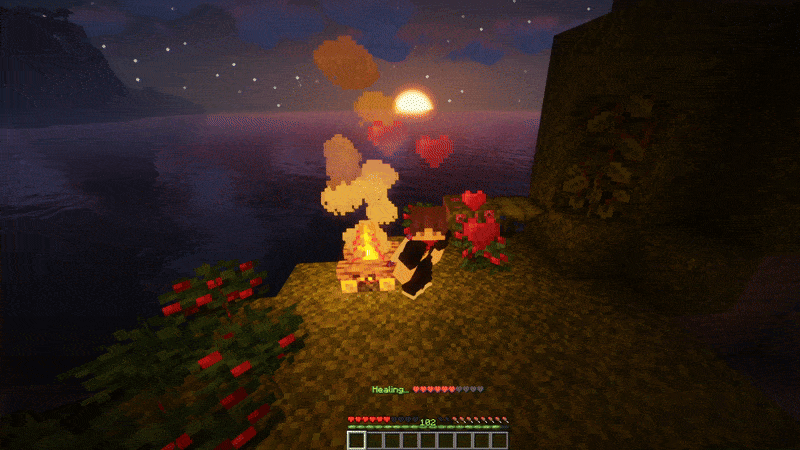
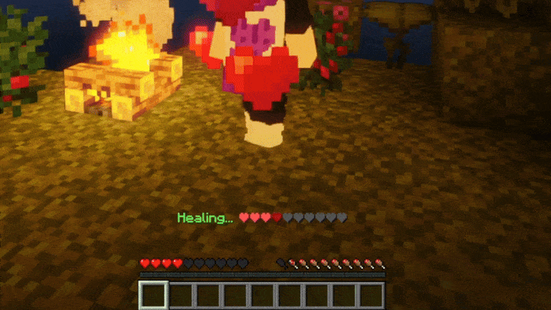
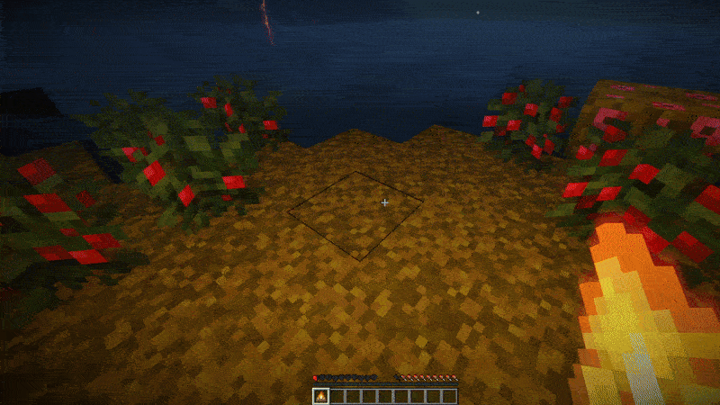
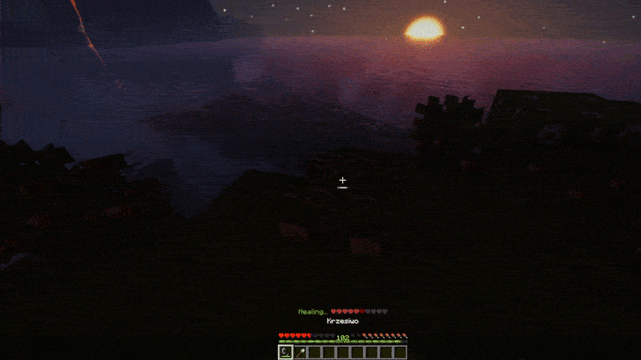
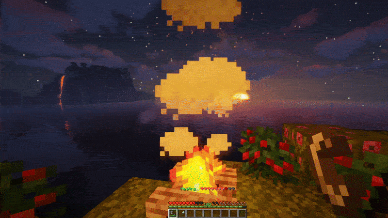

# 🔥 HealingCampfires

> **Warm up. Heal up. Gear up.**
>
> *HealingCampfires* is a powerful, ultra-efficient plugin that transforms ordinary campfires into life-saving beacons. Perfect for survival servers looking to add a strategic twist to exploration and combat.

---

### ✨ Key Features

- 🏕️ **Healing Campfires** – Instantly heal players near campfires and soul campfires.
- 🔥 **Custom Particle Effects** – Enjoy beautiful, immersive healing visuals.
- 🎯 **Configurable Range** – Set the perfect healing radius for your server's playstyle.
- 🔊 **Healing Sounds** – Fully customizable sound effects for a truly immersive experience.
- ⏲️ **Timed Extinguishing** – Optionally extinguish campfires after a set duration.
- 🔥 **Reignite with Flint and Steel** – Light up campfires anytime, just like in vanilla Minecraft.
- 🛠️ **Disable with Shovel** – Smother the flames with a single right-click.
- 💥 **Zero Lag Impact** – Engineered for top-tier performance, even on massive servers.

---

### 🖼️ Showcase

#### ✅ Healing Effect

#### ✅ Healing Health Bar

#### ✅ Campfire Placement

#### ✅ Campfire Light-Up

#### ✅ Campfire Extinguishing

---

### 🔌 Commands & Permissions

| Command                     | Permission                         |  
|----------------------------|-----------------------------------|  
| `/healingcampfire reload` | `command.healingcampfire.reload` |  

---

### 📝 Feedback & Support

Found a bug or have a feature request? Feel free to [open an issue here](https://github.com/imDMK/HealingCampfires/issues) or join our community on Discord for direct support.

---

### 💬 Problems After Purchase & Refund Policy

If you encounter any problems after purchasing the plugin, please report them by [creating an issue on GitHub](https://github.com/imDMK/HealingCampfires/issues). I actively monitor the repository and will do my best to provide a fix or assistance.

**Refunds are not provided**, except in cases where:
- You discover **critical bugs** that prevent the plugin from functioning as described.
- The issue persists for a prolonged period **without a working solution or support**.

Your understanding is appreciated — thank you for supporting!

---

### ⭐ Like the plugin?

If you enjoy using *HealingCampfires*, consider leaving a positive review or star on [SpigotMC](https://www.spigotmc.org/resources/healingcampfires) or [GitHub](https://github.com/imDMK/HealingCampfires) — it really helps!
